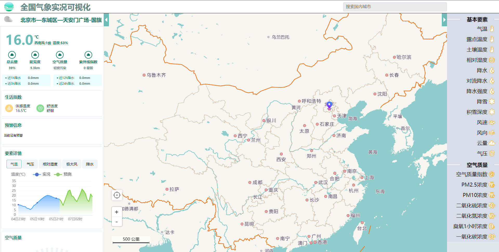
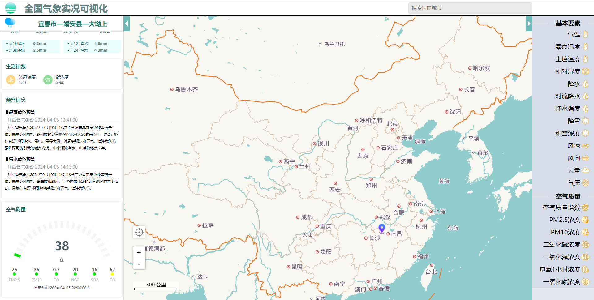
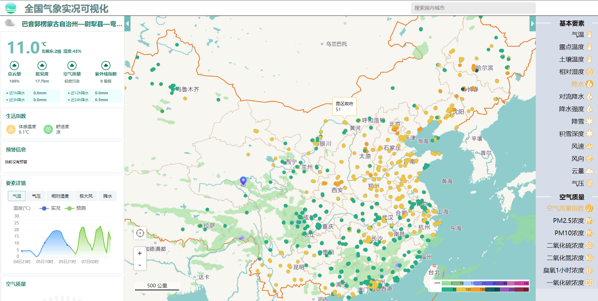
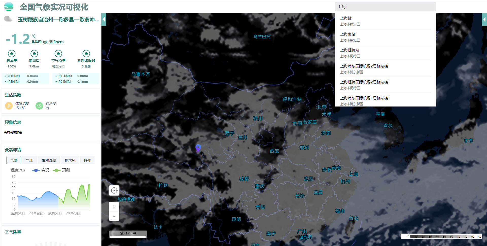

# 基于Vue3、TypeScript与高德地图构建的全国气象实况可视化

## 介绍

该项目是基于 Vue3 和 TypeScript 与高德地图的 @vuemap/vue-amap 组件库搭建的一个 PC 端气象实况网站，主要实现：实时天气信息展示，预警信息，定位，搜索城市信息等，并使用 echarts 以及 vue-amap 图层实现数据可视化。

数据来源：https://data.cma.cn/dataGis/static/gridgis/#/pcindex
热力图瓦片数据来源：https://openweathermap.org/api/weather-map-2

## 项目运行

1. 克隆或下载项目

2. 安装依赖

   ```
   // npm
   npm install
   
   // pnpm
   pnpm install
   ```

   

3. 部署服务端

   后端接口：[weather_visualization_api](https://github.com/HZhertz/weather_visualization_api)

4. 运行项目

   ```
   // npm
   npm run dev
   
   // pnpm
   pnpm run dev
   ```

## 技术栈

- vue3
- vite
- TypeScript
- axios
- @vuemap/vue-amap
- echarts
- postcss-px-to-viewport
- sass

## 效果图








